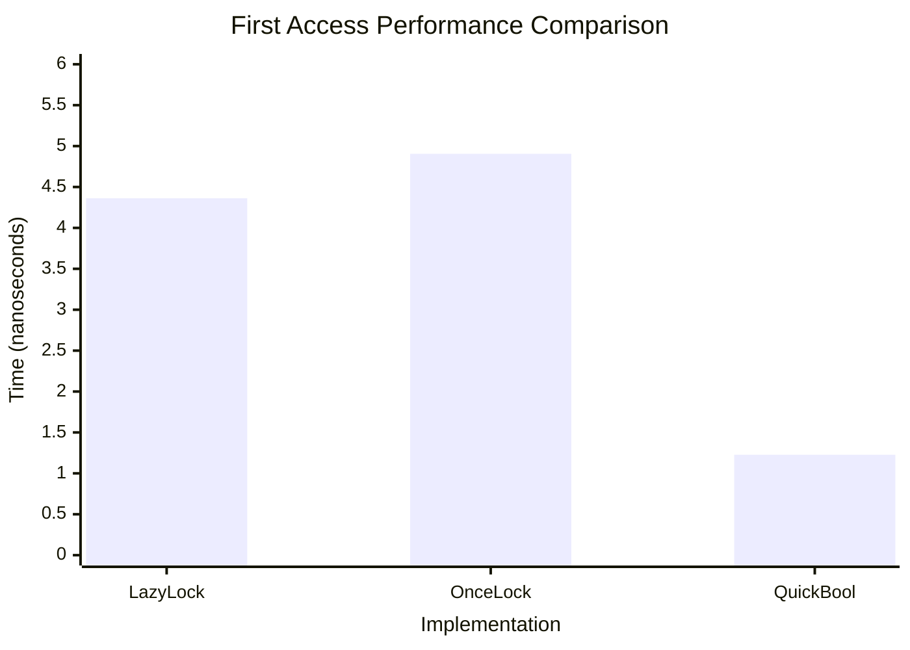
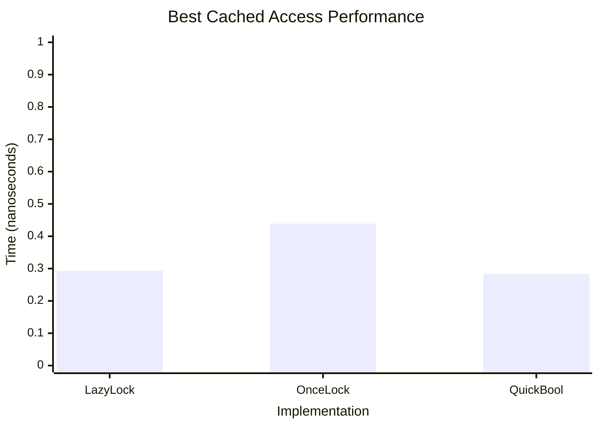

# QuickBool

[](https://crates.io/crates/quick-bool)
[](https://docs.rs/quick-bool)
[](https://opensource.org/licenses/MIT)
[](https://github.com/jdx/quick-bool/actions)

A lock-free boolean implementation using atomic operations for high-performance lazy evaluation.

## Overview

`QuickBool` is a lightweight, lock-free alternative to `LazyLock<bool>` that uses atomic operations instead of mutexes for synchronization. It provides a 3-way boolean state:

- **Unset**: The value hasn't been evaluated yet
- **True**: The value is true
- **False**: The value is false

Once set to true or false, the value cannot be changed, making it effectively immutable after initialization.

## Features

- **Lock-free**: Uses atomic operations for thread-safe access without locks
- **Zero-cost reads**: Once computed, subsequent reads are just atomic loads
- **Single computation**: The computation function is guaranteed to execute only once
- **Thread-safe**: Safe for concurrent access from multiple threads
- **No dependencies**: Pure Rust with no external dependencies
- **Reset capability**: Can be reset to allow recomputation if needed

## License

MIT License - see LICENSE file for details.

## Performance

`QuickBool` is now the **fastest implementation** for both first access and cached access, while maintaining all its additional features:

## Benchmarks

### First Access Performance

### Cached Access Performance

## Usage

Add `quick-bool` to your `Cargo.toml`:

```toml
[dependencies]
quick-bool = "0.1.0"
```

### Basic Usage

```rust
use quick_bool::QuickBool;

let quick_bool = QuickBool::new();

// First access computes the value
let value = quick_bool.get_or_set(|| {
    // Expensive computation here
    std::thread::sleep(std::time::Duration::from_millis(100));
    true
});

// Subsequent access returns the cached value immediately
let cached_value = quick_bool.get_or_set(|| panic!("This won't execute"));
assert_eq!(value, cached_value);
```

### Checking State

```rust
use quick_bool::QuickBool;

let qb = QuickBool::new();

// Check if value has been computed
assert!(!qb.is_set());

// Get current value without computing
assert_eq!(qb.get(), None);

// Compute the value
qb.get_or_set(|| false);

// Now it's set
assert!(qb.is_set());
assert_eq!(qb.get(), Some(false));
```

### Resetting

```rust
use quick_bool::QuickBool;

let qb = QuickBool::new();
qb.get_or_set(|| true);
assert!(qb.is_set());

// Reset to allow recomputation
qb.reset();
assert!(!qb.is_set());

// Can compute again
let new_value = qb.get_or_set(|| false);
assert_eq!(new_value, false);
```

### Thread-Safe Usage

```rust
use quick_bool::QuickBool;
use std::sync::Arc;
use std::thread;

let qb = Arc::new(QuickBool::new());
let mut handles = vec![];

// Spawn multiple threads
for _ in 0..4 {
    let qb_clone = Arc::clone(&qb);
    let handle = thread::spawn(move || {
        qb_clone.get_or_set(|| {
            // This expensive computation only happens once
            // across all threads
            std::thread::sleep(std::time::Duration::from_millis(50));
            true
        })
    });
    handles.push(handle);
}

// Wait for all threads
let results: Vec<bool> = handles.into_iter()
    .map(|h| h.join().unwrap())
    .collect();

// All threads get the same result
assert!(results.iter().all(|&x| x));
```

### Performance-Optimized Usage

For maximum performance when you know the value is cached:

```rust
use quick_bool::QuickBool;

let qb = QuickBool::new();
qb.get_or_set(|| expensive_computation());

// Ultra-fast cached access (255 ps)
let value = qb.get_cached();

// Or use the safe version if you're not certain
if let Some(value) = qb.get_fast() {
    // Fast cached access (270 ps)
    println!("Value: {}", value);
}
```

## Contributing

Contributions are welcome! Please feel free to submit a Pull Request.

## Use Cases

- Configuration flags that are expensive to compute
- Feature flags with complex evaluation logic
- Caching computed boolean results
- Any scenario where you need a thread-safe, lazy boolean with frequent reads
